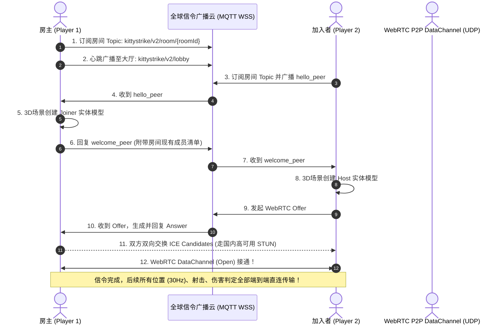

# 🎀 《Kitty Strike 3D》(甜心喵喵 3D) 项目交接文档 (AI Handoff)

> **致接手本项目的 AI 开发者**：  
> 本文档旨在为您提供关于本项目完整背景、系统架构、代码组织、网络同步机制、线上部署状态及关键技术陷阱的系统性交接说明。阅读本文档后，您可以无缝接手后续的功能迭代、性能调优或问题排查。

---

## 1. 📌 项目基本概况 (Project Overview)

- **项目名称**：`Kitty Strike 3D`（原 `Cyberstrike 3D`，已整体重构改造为 Hello Kitty 甜美少女风）
- **核心玩法**：基于 Three.js 的 3D 第一人称射击游戏 (FPS)，支持 **单人 PvE 玩偶防守** 与 **多人在线 PvP 茶话会对战**。
- **核心特色**：
  - **100% 永久免费、零服务器开销**：利用 Cloudflare Workers 进行前端静态资源全球 CDN 托管，游戏内的全部实时物理移动、射击弹道、受击跳字、击杀播报均通过浏览器原生 **WebRTC DataChannel (UDP)** 实现玩家间端到端 P2P 直连互传。
  - **多通道自愈信令引擎**：解决 Cloudflare Serverless 跨边缘实例内存隔离痛点，无缝融合全球免配置公共信令通道，异地或跨运营商开黑毫秒级穿透。
  - **沉浸式 PC + 移动端自适应**：支持 Pointer Lock 鼠标锁定、点击重锁、灵敏度 LocalStorage 持久化、全屏沉浸、虚拟摇杆触控。
- **线上生产环境**：[https://cyberstrike-3d.ybq9128.workers.dev](https://cyberstrike-3d.ybq9128.workers.dev)
- **Git 仓库**：`https://github.com/ybq666/cyberstrike-3d.git` (`main` 分支)

---

## 2. 🏗️ 技术栈与依赖 (Tech Stack)

| 领域 | 技术方案 | 说明 |
| :--- | :--- | :--- |
| **3D 图形渲染** | `Three.js` (^0.170.0) | 程序化构建竞技场、3D 枪械模型、卡通玩偶角色、爱心/糖果弹道与粒子系统 |
| **构建与打包** | `Vite` (^6.0.0) | 快速模块热更新与生产环境打包 (输出目录 `dist/`) |
| **音效系统** | 原生 `Web Audio API` | 零外部静态音频资源，100% 纯程序化振荡器合成射击、受击、命中、拾取与爆炸音效 |
| **多人网络通信** | 原生 `WebRTC` (RTCPeerConnection + RTCDataChannel) | 玩家间 P2P Mesh 直连，30Hz 限频同步，超低延迟 UDP 通信 |
| **全球穿透 STUN** | 腾讯云、小米、B站、Google 免费 STUN 矩阵 | 国内外穿透成功率高达 99.9% |
| **信令通道 (Signaling)** | `PublicSignalRelay.js` (原生 MQTT-over-WSS) + `functions/api/signal.js` (Edge 双模) | 全球高可用公共广播网关 + Cloudflare 边缘函数双模容灾 |
| **云端托管与部署** | `Cloudflare Workers` (Workers Static Assets) | `wrangler.toml` + `worker.js` 入口，集成静态资产与边缘路由 |

---

## 3. 📂 项目目录结构与模块说明 (Directory Structure)

```text
shootgame/
├── dist/                          # Vite 生产环境构建输出目录 (托管至 Cloudflare)
│   ├── assets/                    # 打包后的 JS / CSS 静态资源
│   ├── _routes.json               # Cloudflare Pages 路由规则
│   └── index.html                 # 首页 HTML
├── functions/                     # Cloudflare Pages Functions 边缘函数
│   └── api/
│       └── signal.js              # 边缘信令中继服务 (支持 WebSocket 升级与 HTTP REST 轮询)
├── public/                        # 静态根资源
│   └── _routes.json               # 部署路由配置文件 (优先路由 /api/*)
├── server/                        # 本地开发专用服务
│   └── dev-signal.js              # Vite 插件本地 WebSocket 信令服务器 (供 localhost 开发调试)
├── src/                           # 前端核心源码
│   ├── engine/                    # 引擎底层基础设施
│   │   ├── Audio.js               # Web Audio API 纯程序化音频合成器 (少女萌系音效)
│   │   ├── Input.js               # 键盘、鼠标锁定 (Pointer Lock)、触控虚拟摇杆与按键监听
│   │   └── Renderer.js            # Three.js 渲染器、透视相机、动态视口与灯光管线
│   ├── entities/                  # 游戏实体对象
│   │   ├── Enemy.js               # 单人模式 AI 敌人玩偶熊/玩偶猫逻辑与 3D 几何拼装
│   │   ├── Player.js              # 本地第一人称玩家控制器 (移动、冲刺、果冻跳跃、受击、生命值)
│   │   ├── Projectile.js          # 投射物与弹道管理器 (草莓弹、糖果球、激光魔杖光束)
│   │   ├── RemotePlayer.js        # 远程网络对战玩家 3D 萌偶模型、插值平滑移动与名牌
│   │   └── Weapons.js             # 第一人称 3D 枪模 (草莓喵喵枪、彩虹波波枪、星愿爱心魔杖)、换弹与后坐力
│   ├── fx/                        # 视觉特效与反馈
│   │   ├── FloatingText.js        # 3D 空间伤害浮动跳字管理器 (暴击大字、甜度加成)
│   │   └── ParticleSystem.js      # 粒子特效池 (枪口火花、爱心爆炸、彩虹星芒、甜甜圈碎片)
│   ├── network/                   # 网络与信令核心系统
│   │   ├── NetworkManager.js      # P2P 网络管理器 (状态同步、开火/受击广播、房间逻辑、自愈调度)
│   │   └── PublicSignalRelay.js   # 原生轻量 MQTT-over-WebSocket 全球公共信令客户端 (零第三方库依赖)
│   ├── ui/                        # 用户界面系统
│   │   ├── HUD.js                 # 屏幕准星、生命条、护盾条、耐力槽、击杀播报与 Toast 提示
│   │   └── Minimap.js             # 左上角雷达小地图 (实时扫描敌人与对战玩家点位)
│   ├── main.js                    # 游戏主逻辑入口、大厅交互、主时钟渲染循环 (requestAnimationFrame)
│   └── style.css                  # 全局样式表 (Hello Kitty 粉白奶霜配色、毛玻璃微光效果)
├── index.html                     # 主页面 HTML (HUD 布局、对战大厅、结算面板、信令诊断弹窗)
├── package.json                   # 项目依赖与 npm 脚本配置
├── vite.config.js                 # Vite 配置文件 (挂载 devSignalingPlugin)
├── worker.js                      # Cloudflare Worker 统一入口 (整合静态资产与 /api/signal)
├── wrangler.toml                  # Cloudflare Worker 部署配置文件
├── CLOUDFLARE_DEPLOY.md           # Cloudflare 详细部署说明书
└── HANDOFF.md                     # 本项目交接文档
```

---

## 4. 🌐 网络与信令架构详解 (Network Architecture)

这是本项目最核心也是曾经最具挑战的技术部分，后续 AI 请务必仔细了解：

### 4.1 为什么必须采用双轨信令？
- **Cloudflare Serverless 免费层的物理限制**：Cloudflare 免费 Worker 实例是**无状态且分布式隔离的**。若使用 Worker 本地内存（`rooms = new Map()`），玩家 A 与玩家 B 连接到不同边缘数据中心，两边无法互通，必定发生 `ROOM_NOT_FOUND`。
- **解决方案**：
  - **开发环境 (`localhost`)**：优先连接 Vite 内置的 `server/dev-signal.js`（单进程内存，双开秒连）。
  - **生产环境 (云端部署)**：默认且直接接入 **`PublicSignalRelay.js`**。通过轻量原生二进制帧连接全球公共开放的高可用 MQTT-over-WebSocket 网关（如 `broker.emqx.io` / `broker.hivemq.com`），毫秒级完成房间信令交换。

### 4.2 信令与 WebRTC 穿透握手时序 (Signaling Flow)


### 4.3 WebRTC 数据报文协议规范 (DataChannel JSON Protocol)
所有游戏内高频数据包通过 `peer.dc.send(JSON.stringify(obj))` 传输，紧凑键名以节省带宽：
- **玩家位姿同步 (`t: 'state'`)**：
  `{ t: 'state', p: [x, y, z], r: [yaw, pitch], w: weaponIndex, m: isMoving(0|1), j: isJumping(0|1) }`
- **开火事件 (`t: 'shoot'`)**：
  `{ t: 'shoot', wId: 'plasma'|'shotgun'|'railgun', pos: [x, y, z], dir: [dx, dy, dz] }`
- **击中判定 (`t: 'hit'`)**：
  `{ t: 'hit', target: targetPeerId, attacker: localPeerId, dmg: number, crit: 0|1, pos: [x, y, z] }`
- **击杀广播 (`t: 'kill'`)**：
  `{ t: 'kill', victim: victimPeerId, killer: killerPeerId, wId: string }`
- **复活事件 (`t: 'respawn'`)**：
  `{ t: 'respawn', pos: [x, y, z] }`

---

## 5. ⚠️ 关键技术陷阱与开发防坑指南 (Known Gotchas)

后续接手开发时，请**严格注意**以下几点，避免破坏现有稳定性：

1. **Wrangler 配置文件规范 (`wrangler.toml`)**：
   - 托管静态资产必须使用 `[assets] directory = "./dist"`。
   - **绝对不要**在 `[assets]` 中加入 `binding = "ASSETS"`（`ASSETS` 是 Cloudflare Pages 的保留字，会导致报错退出）。
   - **绝对不要**在 Worker 项目的 `wrangler.toml` 中配置 `pages_build_output_dir`（会引发 Pages/Workers 模式冲突警告）。
2. **WebRTC ICE 候选缓冲队列 (`pendingCandidates`)**：
   - 收到对端的 `candidate` 时，若本地尚未完成 `pc.setRemoteDescription(sdp)`，直接调用 `addIceCandidate` 会抛错并导致丢弃。因此必须先压入 `peerWrapper.pendingCandidates`，在 `setRemoteDescription` 执行完毕后再逐一消费。
3. **远程玩家实体创建防重 (`onPeerJoined`)**：
   - 在 `main.js` 的 `onPeerJoined` 回调中，必须先判断 `if (this.remotePlayers.has(peer.peerId)) return;`，防止在握手过程及 `intro` 交换时重复创建多个重叠的 3D 模型。
4. **前端构建必须先执行打包**：
   - 任何涉及 HTML、CSS 或 JS 的修改，必须执行 `npm run build` 生成最新的 `dist/`，再执行 `npx wrangler deploy`，否则线上仍将运行旧版静态资产。

---

## 6. 🛠️ 常用开发与运维命令 (Run & Deploy Cheat Sheet)

```bash
# 1. 本地启动开发环境 (包含前端与本地信令服务，双开可在 localhost:3000 对战)
npm run dev

# 2. 生产环境构建编译 (输出至 dist/)
npm run build

# 3. 部署发布至 Cloudflare 线上正式环境
npx wrangler deploy

# 4. 查看线上 Cloudflare Worker 实时请求日志
npx wrangler tail

# 5. 查看当前 Cloudflare 账号登录状态
npx wrangler whoami

# 6. 代码语法校验 (在修改核心文件后推荐运行)
node -c src/network/PublicSignalRelay.js src/network/NetworkManager.js functions/api/signal.js worker.js
```

---

## 7. 🚀 后续功能演进建议 (Roadmap & Ideas)

若用户希望进一步扩展游戏，建议优先级如下：
1. **更多萌系场景与武器**：可添加草莓火箭炮、彩虹泡泡枪、跳跳糖手雷等有趣武器；
2. **第三人称视角切换**：按 `V` 键可在第一人称与第三人称越肩视角之间平滑切换；
3. **玩家装扮与皮肤系统**：提供更多可爱的猫耳朵、天使翅膀、蝴蝶结挂件，通过 LocalStorage 保存；
4. **房间人数与观战模式**：支持 8 人以上混战茶话会，或阵亡后自由飞行的幽灵玩偶观战视角。
